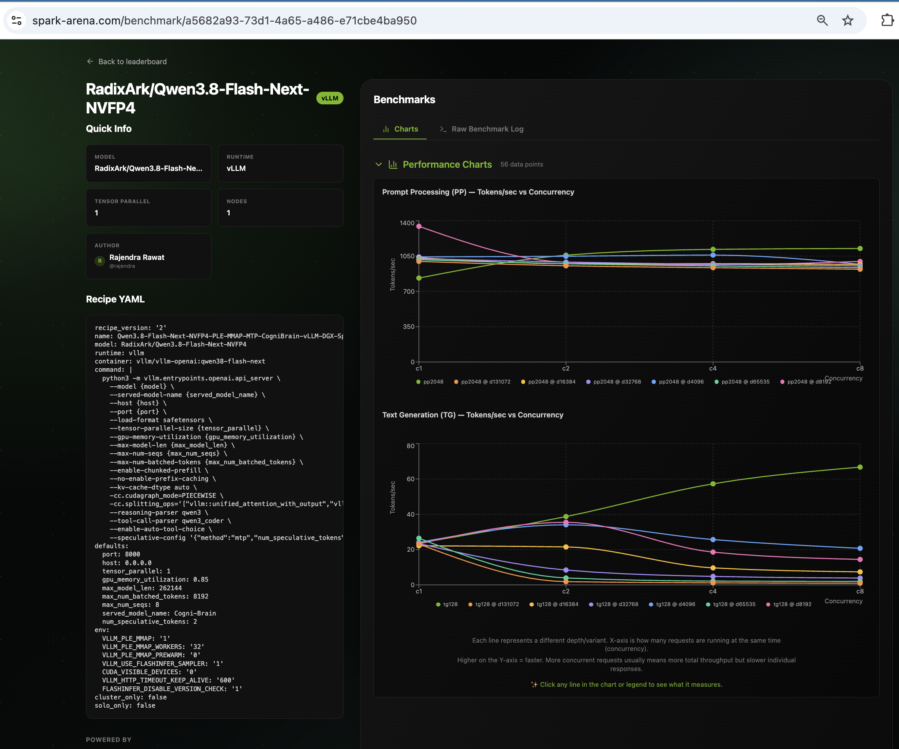
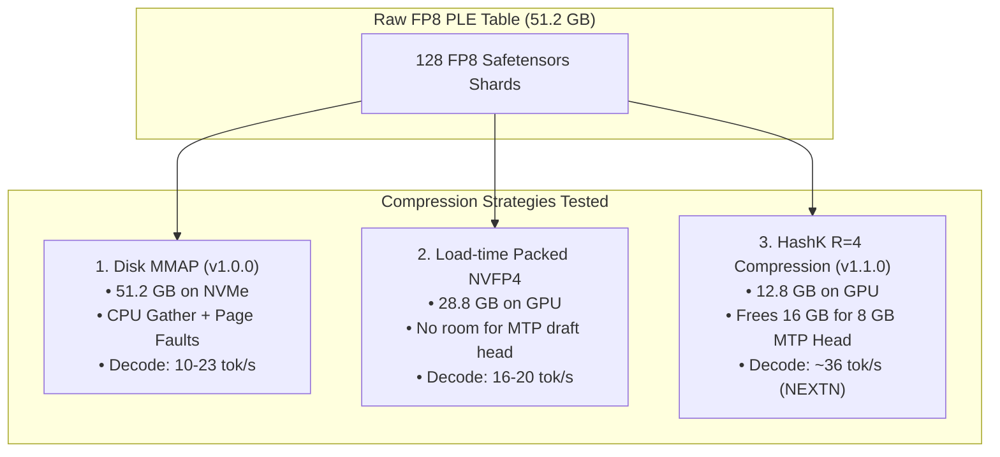

# Experiments & Benchmark Evidence: Qwen3.8-Flash-Next on Single DGX Spark

This document captures the experimental evaluations, architectural investigations, and visual test evidence across releases of running [RadixArk/Qwen3.8-Flash-Next-NVFP4](https://huggingface.co/RadixArk/Qwen3.8-Flash-Next-NVFP4) (~176B total params, 6B active) on a single NVIDIA DGX Spark / GB10 (128 GB unified memory).

---

## 1. Visual Benchmark Evidence (Release v1.0.0 Testing)

The following screenshots capture the verified empirical test suite from the initial **v1.0.0 Release** (vLLM + PLE MMAP baseline on DGX Spark):

### A. Spark Arena Verified Benchmark Submission
Official verified run submitted to Spark Arena testing context depths from 0 to 128k across concurrencies 1, 2, 4, 8:

> 🔗 **Interactive Online Submission:** [spark-arena.com/benchmark/a5682a93-73d1-4a65-a486-e71cbe4ba950](https://spark-arena.com/benchmark/a5682a93-73d1-4a65-a486-e71cbe4ba950)

---

### B. Speed & Context Window Sweep (v1.0.0 Baseline)
Automated speed probe evaluating single-stream decode TPS, TTFT, concurrency aggregate throughput, and context depth scaling up to 174k tokens:

---

### C. Agentic Tool-Calling & Reasoning (tool-eval-bench)
Evaluation on 15 complex tool-calling scenarios including multi-step chains, parameter precision, refusal behavior, and error recovery:

*Final Score: **93/100 (14/15 PASS)***

---

## 2. Experimental Progression: v1.0.0 (MMAP) vs v1.1.0 (HashK + SGLang)

| Benchmark / Metric | Release v1.0.0 (PLE Disk MMAP) | Release v1.1.0 (HashK + NEXTN) | Delta / Improvement |
| :--- | :--- | :--- | :--- |
| **Decode Speed (Code / Structured)** | 23–26 tok/s | **~36 tok/s** | **+44% faster decode** |
| **Decode Speed (Free-form)** | 10–15 tok/s | **~21–27 tok/s** | **+75% faster decode** |
| **Warm Prefill (Prefix Cache)** | ~2,500 tok/s | **up to ~139,000 tok/s** | **56× speedup** via RadixAttention |
| **Concurrency Aggregate (4 streams)** | 31.3 tok/s | **~57 to 96.3 tok/s** | **~2–3× higher aggregate** |
| **PLE Table Location** | Host page cache via NVMe SSD | **100% GPU Resident** (12.8 GB) | Zero host/CPU synchronization |
| **KV Cache Capacity** | ~20k–50k tokens (BF16) | **~700k–900k tokens (FP8)** | True 262k context with 4–8 streams |
| **Executed Code Benchmark** | 10/12 | **12/12 (100% Pass)** | Eliminates runaway verbosity drift |

---

## 3. Architectural Experiments & Theoretical Ablations

### A. PLE Compression: HashK vs Alternatives

The 51.2 GB PLE n-gram table (320M rows × 160 dimensions FP8) cannot be quantized with standard FP4 GEMM toolchains because it is a **hash-addressed gather**, not a dense matmul. We explored multiple compression strategies:

1. **Mean-Pooling Theoretical Ceiling**:
   - Compressing with ratio $R=4$ by pooling rows hashing to the same slot yields an exact cosine similarity of:
     $$\text{Cosine}(\hat{x}, x) \approx \frac{1}{\sqrt{R}} = \frac{1}{\sqrt{4}} = 0.50$$
   - Per-head $160 \times 160$ ridge-fitted linear projection matrices ($W_h$) map reconstructions back toward true rows.
2. **Ablation Findings**:
   - **Signed accumulation**: Slightly worse than plain mean (rows share common components that mean-pooling preserves, whereas sign-cancellation degrades them).
   - **Norm-weighted pooling**: Showed no improvement over plain mean because row norms across the table are already tightly distributed.
   - **Model Gating Resilience**: Qwen's PLE architecture applies 1D convolutions and grouped-norm gating before injecting retrieved vectors into the residual stream, effectively filtering reconstruction noise.

---

## 4. Grace Blackwell (GB10 / SM121) Runtime Experiments

Running Qwen3.8-Flash-Next on a single GB10 isolated 4 upstream kernel issues:

1. **TRTLLM-Gen Decode SM121 Gating**:
   - *Problem*: Stock TRTLLM-gen decode kernels emit silent NaN / token-0 (`!!!!`) on SM121.
   - *Fix*: [`patches/qwen_sparse_attn_backend.py`](patches/qwen_sparse_attn_backend.py) routes SM121 to a direct `req_to_token` gather with masked SDPA.
2. **FlashAttention-4 TMA-O Epilogue**:
   - *Problem*: Upstream variable-length sequence guards were omitted in the stock PyPI wheel, causing MLIR compiler crashes on Grace Blackwell.
   - *Fix*: [`patches/flash_fwd.py`](patches/flash_fwd.py) re-enables `mCuSeqlensQ is None` guards.
3. **Mamba DeltaNet Speculative State Rollback**:
   - *Problem*: Rejected NEXTN candidate tokens corrupted DeltaNet recurrent state without checkpoints.
   - *Fix*: Configured `--mamba-scheduler-strategy extra_buffer --mamba-track-interval 64` to enable exact rewind on draft rejection.
4. **Long-Prefill FP8 RHS Dot**:
   - *Problem*: Triton kernel failed compilation on FP8 rhs operands during long context prefill.
   - *Fix*: [`patches/sparse_attn.py`](patches/sparse_attn.py) casts keys to query dtype before computing attention dot products.

---

## 5. Summary of Experimental Reliability Probes

To ensure long-term stability and prevent silent degradation on production DGX Spark nodes:

- [`tools/poison_sentinel.sh`](tools/poison_sentinel.sh): Canary probe running deep-context requests to verify output validity and auto-recover if poisoned.
- [`tools/watchdog.sh`](tools/watchdog.sh): Rate-limited watchdog monitoring decode batch logs to detect and restart silent wedges (accept-len 1.00 while `/health` is 200).
- [`tools/bench_cc3.py`](tools/bench_cc3.py): Validated concurrency benchmark measuring true window-aggregate decode throughput.
