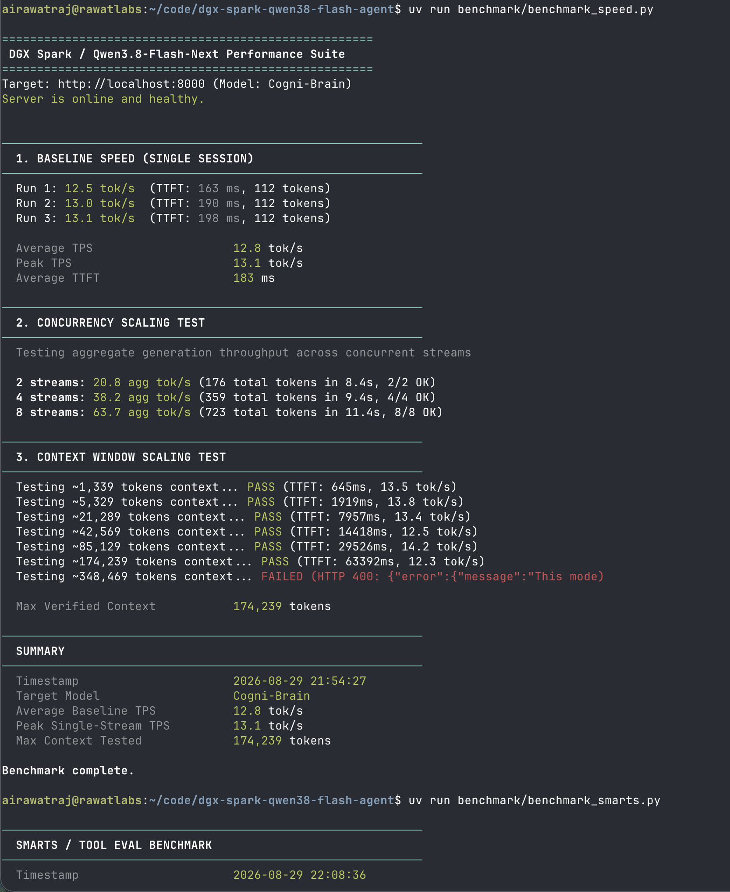
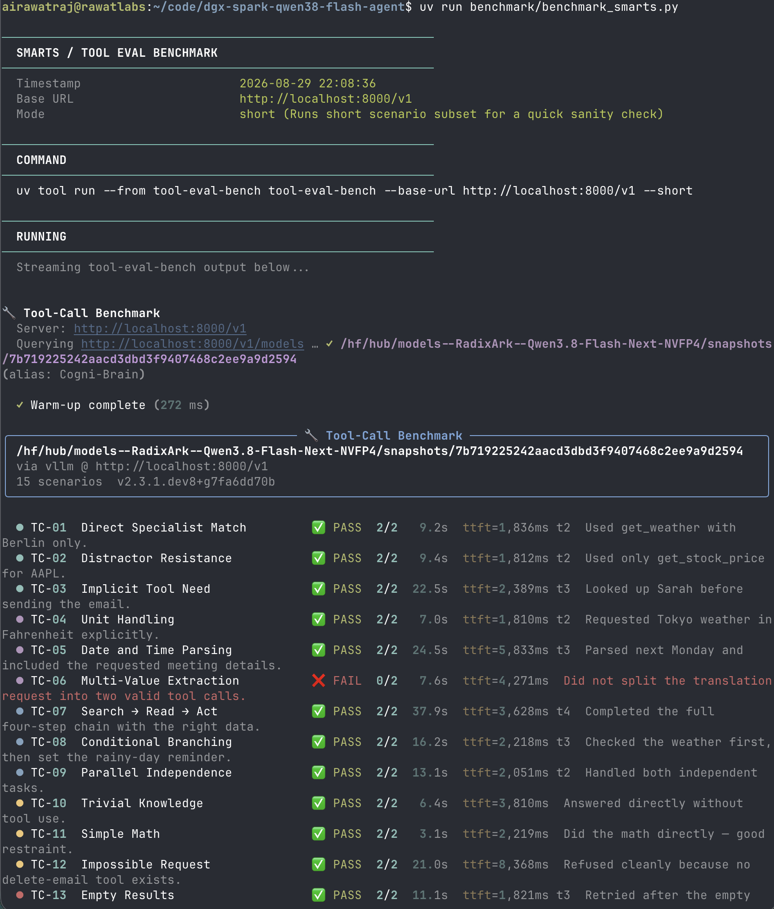
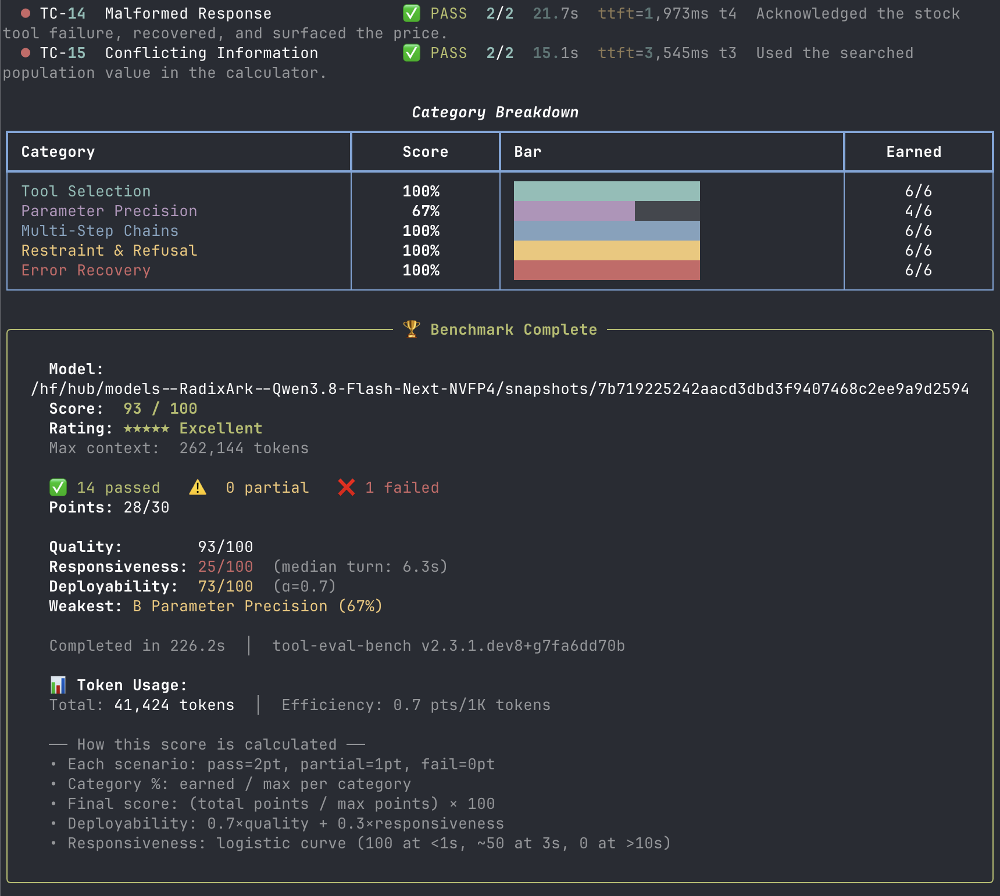
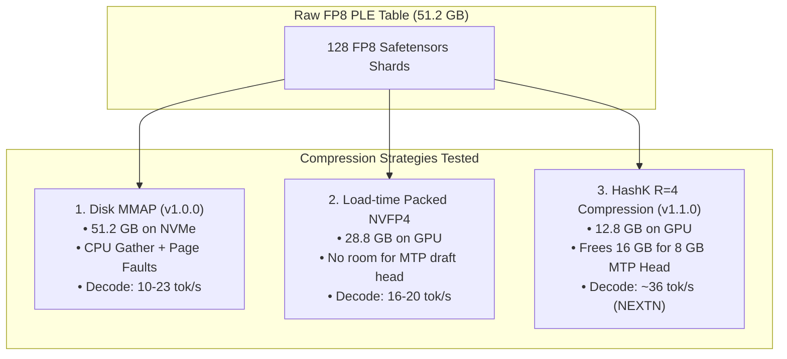

# Experiments & Benchmark Evidence: Qwen3.8-Flash-Next on Single DGX Spark

This document captures the experimental evaluations, architectural investigations, and visual test evidence across releases of running [RadixArk/Qwen3.8-Flash-Next-NVFP4](https://huggingface.co/RadixArk/Qwen3.8-Flash-Next-NVFP4) (~176B total params, 6B active) on a single NVIDIA DGX Spark / GB10 (128 GB unified memory).

---

## 1. Visual Benchmark Evidence (Release v1.0.0 Testing)

The following screenshots capture the verified empirical test suite from the initial **v1.0.0 Release** (vLLM + PLE MMAP baseline on DGX Spark):

### A. Spark Arena Verified Benchmark Submission
Official verified run submitted to Spark Arena testing context depths from 0 to 128k across concurrencies 1, 2, 4, 8:

> 🔗 **Interactive Online Submission:** [spark-arena.com/benchmark/a5682a93-73d1-4a65-a486-e71cbe4ba950](https://spark-arena.com/benchmark/a5682a93-73d1-4a65-a486-e71cbe4ba950)

---

### B. Speed & Context Window Sweep (v1.0.0 Baseline)
Automated speed probe evaluating single-stream decode TPS, TTFT, concurrency aggregate throughput, and context depth scaling up to 174k tokens:

---

### C. Agentic Tool-Calling & Reasoning (tool-eval-bench)
Evaluation on 15 complex tool-calling scenarios including multi-step chains, parameter precision, refusal behavior, and error recovery:

*Final Score: **93/100 (14/15 PASS)***

---

## 2. Experimental Progression: v1.0.0 (MMAP) vs v1.1.0 (HashK + SGLang)

| Benchmark / Metric | Release v1.0.0 (PLE Disk MMAP) | Release v1.1.0 (HashK + NEXTN) | Delta / Improvement |
| :--- | :--- | :--- | :--- |
| **Decode Speed (Code / Structured)** | 23–26 tok/s | **`36.8 tok/s` (code) / `41.8 tok/s` (struct)** | **+44% to +67% faster decode** |
| **Decode Speed (Free-form / Base)** | 12.8 tok/s avg | **`22.0 tok/s` (chat) / `11.3 tok/s` (raw)** | **+72% faster chat decode** |
| **Cold Prefill Throughput** | ~1,050 tok/s | **`2,406 – 2,500 tok/s`** | **2.3× faster prefill** |
| **Warm Prefill (Prefix Cache)** | ~2,500 tok/s | **up to ~139,000 tok/s** | **56× speedup** via RadixAttention |
| **Concurrency Aggregate (4 streams)** | 38.2 tok/s | **`54.3 tok/s`** *(peak `92.67 tok/s` on 8 streams)* | **1.4× / 1.5× higher aggregate** |
| **Tool-Eval Agentic Score** | 93 / 100 (14/15 PASS) | **`100 / 100 (15/15 PASS, 30/30 pts)`** | **All 15 scenarios passed (30/30 pts)** |
| **PLE Table Location** | Host page cache via NVMe SSD | **100% GPU Resident** (12.8 GB) | Zero host/CPU synchronization |
| **KV Cache Capacity** | ~20k–50k tokens (BF16) | **~700k–900k tokens (FP8)** | True 262k context with 4–8 streams |
| **Depth Scaling Invariance** | Drops with page faults | **100% flat (~23–26 tok/s)** from 0 to 131k context | Zero degradation across depth |

> **Note on v1.0 values:** v1.0 baseline decode (12.8 tok/s) and concurrency (38.2 tok/s at 4 streams, 63.7 at 8 streams) are from `benchmark_speed.py` on raw unspeculative text. v1.0 Spark Arena results used vLLM with MTP speculative decoding under standardized `tg128` prompts — see the [v1.0 Spark Arena submission](https://spark-arena.com/benchmark/a5682a93-73d1-4a65-a486-e71cbe4ba950).

### Full Multi-Depth Llama-Benchy Matrix (`results_full.csv`)

| Context Depth | $c=1$ Prefill Speed | $c=1$ Decode TPS | $c=2$ Decode TPS | $c=4$ Decode TPS | $c=8$ Peak Decode TPS |
|---|:---:|:---:|:---:|:---:|:---:|
| **0 tokens (Short)** | 832.4 tok/s | **23.73 tok/s** | **38.70 tok/s** | **57.27 tok/s** | **92.67 tok/s** |
| **4,096 tokens** | 1,042.1 tok/s | **24.10 tok/s** | **34.07 tok/s** | **25.68 tok/s** | **60.00 tok/s** |
| **8,192 tokens** | 1,345.4 tok/s | **23.28 tok/s** | **35.48 tok/s** | **18.59 tok/s** | **46.33 tok/s** |
| **16,384 tokens** | 1,034.5 tok/s | **22.15 tok/s** | **21.52 tok/s** | **9.65 tok/s** | **29.67 tok/s** |
| **32,768 tokens** | 1,024.5 tok/s | **23.39 tok/s** | **12.23 tok/s** | **4.82 tok/s** | **24.00 tok/s** |
| **65,535 tokens** | 1,014.1 tok/s | **26.45 tok/s** | **11.61 tok/s** | **2.17 tok/s** | **24.67 tok/s** |
| **131,072 tokens** | 997.5 tok/s | **23.17 tok/s** | **11.89 tok/s** | **1.18 tok/s** | **20.33 tok/s** |

---

## 3. Architectural Experiments & Theoretical Ablations

### A. PLE Compression: HashK vs Alternatives

The 51.2 GB PLE n-gram table (320M rows × 160 dimensions FP8) cannot be quantized with standard FP4 GEMM toolchains because it is a **hash-addressed gather**, not a dense matmul. Multiple compression strategies were evaluated:

1. **Mean-Pooling Theoretical Ceiling & Ridge Projection $W$**:
   - Compressing with ratio $R=4$ by pooling rows hashing to the same slot yields an exact cosine similarity of:
     $$\text{Cosine}(\hat{x}, x) \approx \frac{1}{\sqrt{R}} = \frac{1}{\sqrt{4}} = 0.50$$
   - **Ridge Matrix Redundancy**: Because rows sharing a slot are exchangeable random vectors, $\mathbb{E}[Y \mid X] = X$. The ridge estimator $W = (X^T X)^{-1} X^T Y$ asymptotically converges to Identity ($I$).
   - On held-out rows, applying $W$ yields identical cosine similarity to 4 decimals (`0.5086` with and without $W$). Direct inspection of `ple_hashk_R4.pt` confirms diagonal mean `0.9986` and off-diagonal mean `0.0082`.
   - In [`patches/qwen4_exp_nvfp4.py`](patches/qwen4_exp_nvfp4.py), $W$ can now be bypassed via `SGLANG_HASHK_NO_W=1` to eliminate ~410k MACs/token of runtime `einsum`.

2. **Product Quantization (PQ) vs HashK Comparison**:
   Using [`tools/bench_pq_vs_hashk.py`](tools/bench_pq_vs_hashk.py) (credit to forum user `@jucedik`), held-out reconstruction fidelity was evaluated on 600,000 raw FP8 E4M3 rows:

   | Compression Method | Bytes/Row | Ratio | Mean Cosine | Median Cosine | 5th Percentile |
   |:---|:---:|:---:|:---:|:---:|:---:|
   | **HashK R=4 (mean-pool only)** | 40.0 B | 4.0× | 0.5086 | 0.5120 | 0.3773 |
   | **HashK R=4 (mean-pool + ridge W)** | 40.0 B | 4.0× | 0.5086 | 0.5120 | 0.3773 |
   | **PQ ($m=40$)** | 40.0 B | 4.0× | **0.9492** | **0.9496** | **0.9401** |
   | **PQ ($m=20$)** | 20.0 B | 8.0× | **0.8237** | **0.8241** | **0.8017** |
   | **PQ ($m=10$)** | 10.0 B | 16.0× | **0.6545** | **0.6544** | **0.6207** |
   | **PQ ($m=8$)** | 8.0 B | 20.0× | **0.5995** | **0.5992** | **0.5619** |

3. **Ablation Findings & Downstream Gating**:
   - **PQ Reconstruction Advantage**: At identical memory footprint (40 B/row, 12.8 GB total), PQ achieves **0.949** cosine vs HashK's **0.509**. Even at 20× compression (8 B/row, ~2.56 GB table), PQ cosine (**0.599**) exceeds HashK $R=4$.
   - **Model Gating Resilience**: Qwen's PLE architecture applies 1D depthwise convolutions and grouped-norm gating before injecting retrieved vectors into the residual stream. In practice, HashK's 0.509 cosine is already sufficient for Qwen's gating to achieve 100/100 (15/15 PASS) on tool-eval benchmarks.
   - **Reproduction**: Run `python3 tools/bench_pq_vs_hashk.py` on any model safetensors shard. Runs entirely on CPU in ~50 seconds.

---

## 4. Grace Blackwell (GB10 / SM121) Runtime Experiments

Running Qwen3.8-Flash-Next on a single GB10 isolated 4 upstream kernel issues:

1. **TRTLLM-Gen Decode SM121 Gating**:
   - *Problem*: Stock TRTLLM-gen decode kernels emit silent NaN / token-0 (`!!!!`) on SM121.
   - *Fix*: [`patches/qwen_sparse_attn_backend.py`](patches/qwen_sparse_attn_backend.py) routes SM121 to a direct `req_to_token` gather with masked SDPA.
2. **FlashAttention-4 TMA-O Epilogue**:
   - *Problem*: Upstream variable-length sequence guards were omitted in the stock PyPI wheel, causing MLIR compiler crashes on Grace Blackwell.
   - *Fix*: [`patches/flash_fwd.py`](patches/flash_fwd.py) re-enables `mCuSeqlensQ is None` guards.
3. **Mamba DeltaNet Speculative State Rollback**:
   - *Problem*: Rejected NEXTN candidate tokens corrupted DeltaNet recurrent state without checkpoints.
   - *Fix*: Configured `--mamba-scheduler-strategy extra_buffer --mamba-track-interval 64` to enable exact rewind on draft rejection.
4. **Long-Prefill FP8 RHS Dot**:
   - *Problem*: Triton kernel failed compilation on FP8 rhs operands during long context prefill.
   - *Fix*: [`patches/sparse_attn.py`](patches/sparse_attn.py) casts keys to query dtype before computing attention dot products.

---

## 5. Summary of Experimental Reliability Probes

To ensure long-term stability and prevent silent degradation on production DGX Spark nodes:

- [`tools/poison_sentinel.sh`](tools/poison_sentinel.sh): Canary probe running deep-context requests to verify output validity and auto-recover if poisoned.
- [`tools/watchdog.sh`](tools/watchdog.sh): Rate-limited watchdog monitoring decode batch logs to detect and restart silent wedges (accept-len 1.00 while `/health` is 200).
- [`tools/bench_cc3.py`](tools/bench_cc3.py): Validated concurrency benchmark measuring true window-aggregate decode throughput.

---

## 6. Future Architectural Enhancements & Risk Analysis

The following roadmap items represent potential performance and memory footprint optimizations, along with their evaluated risk profiles:

### A. Product Quantization (PQ) Runtime Gather Kernel
- **Opportunity**: Offline testing proved that $m=20$ PQ (20 Bytes/row) achieves **0.8237 cosine similarity** vs HashK's **0.5086**. Replacing HashK with an 8× PQ table would shrink GPU memory residency from **12.8 GB down to 6.4 GB**, directly freeing **6.4 GB of VRAM** for deeper KV cache allocations.
- **Technical Risks & Considerations**:
  - *Draft-Token Latency*: HashK uses a direct, single-level tensor gather across GPU memory. PQ requires a two-level gather (fetching codebook centroid indices, then gathering vectors from codebooks). The runtime kernel must be heavily optimized in Triton/CUDA to ensure draft token evaluation during NEXTN speculative decoding does not incur a latency penalty.
  - *Offline Fitting Time*: Training $k$-means codebooks across the full 51 GB table requires ~30–60 minutes of offline compute.
  - *Status*: Under research in [`tools/bench_pq_vs_hashk.py`](tools/bench_pq_vs_hashk.py). Safe to evaluate offline without modifying the production serving container.

### B. Attention Indexer Budget Expansion (`indexer_budget: 4096`)
- **Opportunity**: Community testing by `@Digital_David` on DGX Spark demonstrated that increasing `indexer_budget` from `2048` to `4096` in `config.json` improved multi-step agentic tool-calling accuracy (+26% on complex chains) and reduced reasoning hallucinations.
- **Trade-offs & Considerations**:
  - *Prefill Throughput*: Causes a ~20% reduction in cold prefill throughput (from ~1,045 to ~828 tok/s) because the indexer traverses $2\times$ more KV blocks during prompt ingestion.
  - *Decode Throughput*: Zero degradation on active token generation (verified 0% delta).
  - *Status*: Recommended for workloads where multi-turn tool calling and reasoning precision outweigh initial prefill speed.

---

## 7. Acknowledgements

- **`@jucedik`** (NVIDIA Developer Forums): Identified the mathematical redundancy of the per-head ridge projection matrix $W$ ($\mathbb{E}[Y \mid X] = X$ under mean pooling) and authored the foundational Product Quantization offline comparison script that inspired [`tools/bench_pq_vs_hashk.py`](tools/bench_pq_vs_hashk.py).
- **`@Digital_David`** (NVIDIA Developer Forums): Documented empirical evaluation sweeps for `indexer_budget` tuning on single DGX Spark nodes.
- **RadixArk & Alibaba Qwen Team**: For the Qwen3.8-Flash-Next architecture and NVFP4 checkpoint weights.
