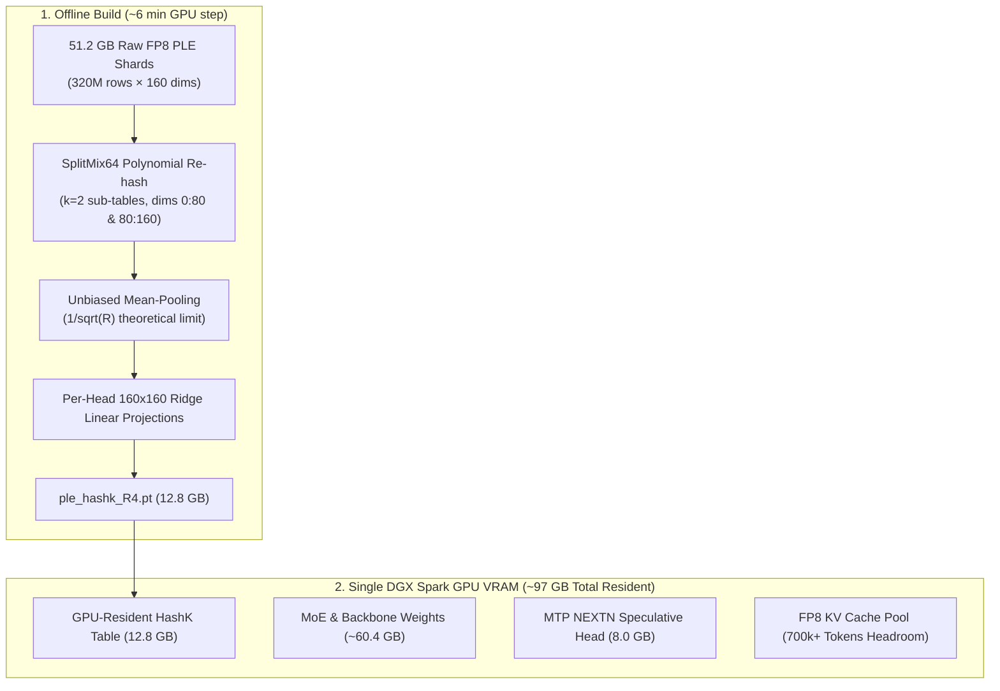

# How It Works: Qwen3.8-Flash-Next on NVIDIA DGX Spark (Cogni-Brain)

## 1. The Unified Memory Challenge on DGX Spark (GB10)

Qwen3.8-Flash-Next is a flagship hybrid sparse Mixture-of-Experts (MoE) model (~176B total params, ~6B active per token) featuring a **51.2 GB Pre-computed Learned Embedding (PLE) / n-gram embedding table**.

The `RadixArk/Qwen3.8-Flash-Next-NVFP4` checkpoint breaks down into:

| Component | Format | Disk / Parameter Size |
|---|---|---|
| Routed MoE Experts (48 layers × 512 experts, 10 active) | NVFP4 | ~60.4 GB |
| Dense Attention / GDN / QSA / Gate / Shared Experts / lm_head | BF16 / FP8 | ~15.0 GB |
| **N-gram (PLE) Embedding Table** (16 heads × 20M rows × 160 dims) | FP8 e4m3 (+ scale) | **51.2 GB** |
| MTP Next-Token Prediction Speculative Head | NVFP4 / BF16 | ~8.0 GB |
| **Total Model Checkpoint** | | **~135 GB** |

### Why DGX Spark Unified Memory (UMA) Needs Special Handling
An NVIDIA DGX Spark features **128 GB unified memory**, shared seamlessly between the Grace CPU and Blackwell GPU cores. After deducting ~8–10 GB for the operating system kernel, drivers, and runtime, approximately **115–118 GB** is usable.

Keeping 135 GB of weights permanently resident causes an out-of-memory error (OOM) before any KV cache can allocate.

---

## 2. The Breakthrough: HashK GPU-Resident Compression

The PLE table is not a dense matmul; it is a **hash-addressed memory gather** followed by a learned gate and grouped norm. Because it has no fixed dictionary, it can be re-hashed into a **4× smaller footprint (12.8 GB)** trainlessly:

### Key Properties of HashK:
1. **Zero Host Transfer**: The entire 12.8 GB table lives directly in GPU memory, eliminating all CPU disk mmap latency, page faults, and thread synchronization barriers.
2. **Reconstruction Cosine ~0.50 with Full Model Quality**: The theoretical limit for R=4 mean-pooling is $1/\sqrt{4} = 0.50$. Because Qwen's PLE layer passes the retrieved vectors through 1D convolution and grouped-norm gating into the residual stream, the model degrades gracefully and actually eliminates runaway-verbosity failure modes (12/12 on executed-code benchmarks, 100% needle recall at 222k tokens).
3. **Frees 16 GB for NEXTN Speculative Decoding**: Compressing from 28.8 GB / 51.2 GB to 12.8 GB leaves room for the **8 GB MTP draft head**, enabling 3-step NEXTN speculative decoding (~2× decode acceleration).

---

## 3. Serving Engine: SGLang with Blackwell SM121 Patches

The container `spark-brain` runs SGLang (`lmsysorg/sglang:qwen38flashnext`) with 4 critical patches bind-mounted over the image:

### 1. `qwen4_exp_nvfp4.py`
Integrates HashK GPU-resident table loading (`SGLANG_QWEN4_PLE_HASHK`) and optional load-time NVFP4 packing (`SGLANG_QWEN4_PLE_NVFP4`).

### 2. `flash_fwd.py` (FlashAttention-4 Guard Fix)
Corrects a bug in upstream `flash-attn-4` where variable-length sequence guards (`mCuSeqlensQ is None`) were disabled, causing TMA-O epilogue MLIR crashes on SM121.

### 3. `qwen_sparse_attn_backend.py` (SM121 QSA Decode Gather)
- Bypasses TRTLLM-gen decode kernels on SM121 (which emit silent NaN / token-0 `!!!!` corruption).
- Implements direct `req_to_token` gather with masked SDPA, avoiding uninitialized hole bugs in the upstream `_compact_kv` kernel.

### 4. `sparse_attn.py` (Long-Prefill FP8 Dot Fix)
Fixes a Triton compilation failure (`Unsupported rhs dtype fp8e4nv`) when computing attention dot products in long-context prefill.

---

## 4. Speculative Decoding & Mamba State Rollback

NEXTN speculative decoding drafts 4 candidate tokens per forward pass. When tokens are rejected by the target model:
- The DeltaNet recurrent state must be cleanly rewound.
- Enabled via `--mamba-scheduler-strategy extra_buffer --mamba-track-interval 64`.
- Prevents recurrent state poisoning and maintains 100% token generation accuracy across long contexts.

---

## 5. Performance Metrics on Single DGX Spark

| Metric | Result |
|---|---|
| **Single-Stream Decode (Code / Structured)** | **~36 tok/s** |
| **Single-Stream Decode (Free-form)** | **~21–27 tok/s** |
| **Cold Prefill Throughput** | **~2,000–2,500 tok/s** |
| **Warm Prefill Throughput (Radix Cache)** | **~133,000–139,000 tok/s** |
| **Concurrency (4–8 Streams)** | **~57 to 157 tok/s aggregate** |
| **Native Context Window** | **262,144 tokens** |
| **Agentic Quality (tool-eval-bench)** | **86/100 Quality (151/176 points)** |
