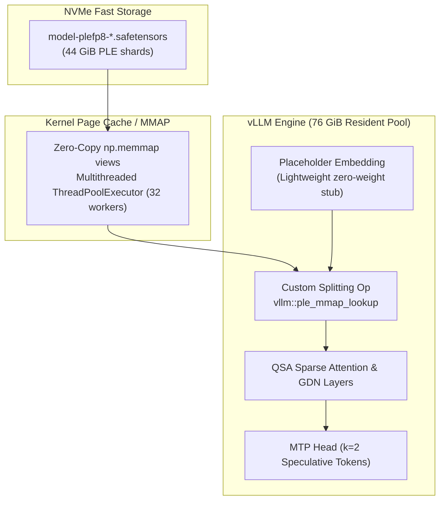

# How It Works: Qwen3.8-Flash-Next on NVIDIA DGX Spark

## 1. The Unified Memory Challenge on DGX Spark (GB10)

Qwen3.8-Flash-Next is a flagship hybrid sparse Mixture-of-Experts (MoE) model with an unconventional architectural component: a **51B-parameter Pre-computed Learned Embedding (PLE) / n-gram embedding table**. 

The `RadixArk/Qwen3.8-Flash-Next-NVFP4` checkpoint breaks down into:

| Component | Format | Disk / Parameter Size |
|---|---|---|
| Routed MoE Experts (48 layers × 512 experts, 10 active) | NVFP4 | ~63 GiB |
| Dense Attention / GDN / QSA / Gate / Shared Experts / lm_head / MTP | BF16 / FP8 | ~15 GiB |
| **N-gram (PLE) Embedding Table** (16 heads × 20M rows × 160 dims) | FP8 e4m3 (+ scale) | **~44 GiB** |
| **Total Model Checkpoint** | | **~122 GiB** |

### Why Standard Offloading Fails on DGX Spark
An NVIDIA DGX Spark features **128 GB unified memory**, shared seamlessly between the Grace CPU and Blackwell GPU cores. After deducting ~8–10 GB for the operating system kernel, drivers, and Docker runtime, approximately **118–120 GB** is usable.

Keeping 122 GiB of weights permanently resident leaves **0 GB for the KV cache**, making it impossible to serve. 

Standard vLLM offloading (`VLLM_PLE_CPU_OFFLOAD=1`) moves parameters to pinned *host RAM*. While effective on multi-socket PCIe systems with separate CPU memory and discrete VRAM, on a DGX Spark host RAM and GPU VRAM reside in the **same physical unified pool**. Moving bytes between host and device pinned buffers does not free a single byte of physical memory.

---

## 2. The Breakthrough: PLE Disk MMAP

The PLE n-gram embedding table is an index **lookup**, not a dense matrix multiplication or convolution.
- For each token, the model reads exactly **16 rows × 160 bytes = 2.56 KB** at hashed addresses.
- Natural language and code demonstrate high n-gram locality: frequent tokens hit a small, concentrated subset of rows that remain hot in the operating system's unified page cache.
- Even an extensive 20,000-token prompt requires only ~320,000 row reads (~1.3 GB), which takes milliseconds on the DGX Spark's onboard NVMe SSD.

By memory-mapping (`mmap`) the checkpoint's `model-plefp8-*.safetensors` shards directly from NVMe, weights loaded into unified memory drop from **122 GiB to ~76 GiB**.

This frees **~52 GiB of unified pool** for the KV cache (~720,000–790,000 token capacity at `GPU_MEM=0.85`), enabling concurrent sessions at native 262K context or a single 500,000-token request with YaRN.

---

## 3. The Patch Architecture (`src/vllm_ple_mmap.py`)

When `VLLM_PLE_MMAP=1` is set, the patch dynamically hooks `Qwen3_8FlashNextNGramEmbedding` inside vLLM:



### 1. `__init__` Hook
Substitutes the 44 GiB `VocabParallelEmbedding` with a lightweight `_MmapNgramEmbedding` placeholder. No large embedding tensor is allocated during model construction.

### 2. `load_weights` Hook
Ignores the 128 PLE shard tensors during weight ingestion (as they are served dynamically from disk), registers only the scalar FP8 `weight_scale`, and opens memory-mapped file descriptors to the safetensors shards.

### 3. `forward_impl` & Custom Splitting Op
Wraps the gather in a custom PyTorch op `vllm::ple_mmap_lookup`. This ensures:
- `torch.compile` treats the gather as an opaque operation.
- vLLM schedules the operation outside captured CUDA graph segments via `-cc.cudagraph_mode=PIECEWISE`.

---

## 4. Workarounds for Blackwell (sm_121) Architecture

Running Qwen3.8-Flash-Next on Blackwell GB10 required resolving three critical runtime edge cases:

1. **Host-to-Device Copy During CUDA Graph Capture**:
   Because mmap gather runs CPU instructions and performs pageable host-to-device transfers, it cannot execute inside an active CUDA graph. Declaring `vllm::ple_mmap_lookup` as a splitting op in `PIECEWISE` graph mode allows vLLM to cleanly segment CUDA graphs around the gather.

2. **Inductor Int64 Indexing Bounds Assert**:
   Stock Inductor compilation on sm_121 triggers an out-of-bounds assert during n-gram index calculation. The custom op isolates the lookup from PyTorch Inductor graph compilation.

3. **Prefix Caching with GDN**:
   Prefix caching with Linear Attention / GDN in vLLM triggers `CUBLAS_STATUS_INTERNAL_ERROR` on repeated identical prompts. Disabling prefix caching (`--no-enable-prefix-caching`) and utilizing chunked prefill (`--enable-chunked-prefill --max-num-batched-tokens 8192`) provides sustained stability.

---

## 5. Long-Context Scaling with YaRN (Up to 500K Tokens)

Qwen3.8-Flash-Next natively supports 262,144 tokens. Using YaRN RoPE interpolation, context is scaled to **500,000 tokens** via:

```json
{
  "text_config": {
    "rope_parameters": {
      "mrope_interleaved": true,
      "mrope_section": [11, 11, 10],
      "rope_type": "yarn",
      "rope_theta": 10000000,
      "partial_rotary_factor": 0.25,
      "factor": 4.0,
      "original_max_position_embeddings": 262144
    }
  }
}
```

### Speculative Draft Model Alignment
When YaRN is active alongside MTP speculative decoding, the draft head's `max_model_len` must be explicitly synchronized with the target context length via `--speculative-config '{"method":"mtp","num_speculative_tokens":2,"max_model_len":500000}'` to prevent mamba block size mismatches.
