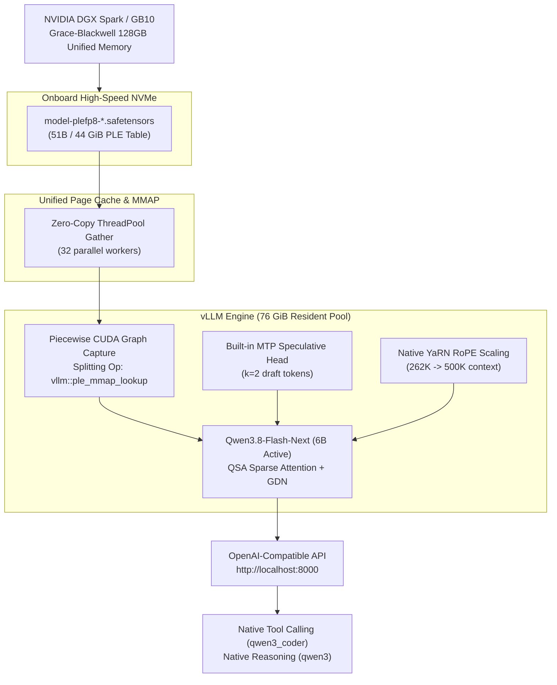

# Running a Real Local AI Agent on DGX Spark: Qwen3.8-Flash-Next via PLE Disk MMAP

I bought a DGX Spark to do real work: running serious local AI agents and training foundation models from scratch - not to run benchmarks.

*(If you are curious about the training side of this hardware, check out [SageGPT](https://github.com/airawatraj/sage-gpt), my 7.5M parameter Sanskrit SLM trained entirely from scratch on this same machine).*


-success)


This repo is part of the DGX Spark local agent series:

| Repo | Role | Key Metric |
|---|---|---|
| [`dgx-spark-nemotron-super-agent`](https://github.com/airawatraj/dgx-spark-nemotron-super-agent) | Deep reasoning large brain | 23.7 tok/s, 131K context |
| [`dgx-spark-qwen-super-agent`](https://github.com/airawatraj/dgx-spark-qwen-super-agent) | Ultra-fast agentic brain via Atlas | 218.8 tok/s, 100/100 smarts |
| [`dgx-spark-qwen38-super-agent`](https://github.com/airawatraj/dgx-spark-qwen38-super-agent) | MTP speculative reasoning brain | 26 tok/s (119 burst), 262K context |
| [`dgx-spark-qwen-omni-super-agent`](https://github.com/airawatraj/dgx-spark-qwen-omni-super-agent) | Long-context DFlash agent | 54.4 tok/s, 262K context |
| [`dgx-spark-gemma4-omni-agent`](https://github.com/airawatraj/dgx-spark-gemma4-omni-agent) | Native multimodal perception agent | Text, image, audio, video frames |
| More setups | [github.com/airawatraj](https://github.com/airawatraj) | Workstation agent profiles |

This iteration runs **[RadixArk/Qwen3.8-Flash-Next-NVFP4](https://huggingface.co/RadixArk/Qwen3.8-Flash-Next-NVFP4)** (~176B total parameters: 125B MoE main + 51B n-gram PLE embedding table, 6B active) on a single **NVIDIA DGX Spark / GB10** (128 GB unified memory). For technical details on the zero-copy mmap architecture and GB10 runtime fixes, see [HOW_IT_WORKS.md](HOW_IT_WORKS.md).

> ⚠️ **Personal workstation setup. Not for enterprise use. Use at your own risk.**

---

## Why This Setup

### The Memory Dilemma on Grace-Blackwell Unified Memory
Qwen3.8-Flash-Next introduces a 51B-parameter n-gram embedding table (Pre-computed Learned Embedding / "PLE"). In NVFP4, the entire checkpoint requires **~122 GiB**.

On an NVIDIA DGX Spark, the **128 GB unified pool** is shared across Grace CPU and Blackwell GPU cores. With ~10 GB reserved for OS and runtime, 122 GiB of resident weights leaves **zero memory for the KV cache**. Standard CPU offload flags (`VLLM_PLE_CPU_OFFLOAD=1`) fail because host and device memory are physically identical.

### The Breakthrough: Zero-Copy PLE Disk MMAP
Because the PLE table is a sparse lookup (only 16 rows × 160 bytes = 2.56 KB per token), it does **not** need to remain resident in RAM.

This repository serves the 44 GiB FP8 PLE table shards **directly from NVMe storage via `mmap`** using multithreaded workers (`src/vllm_ple_mmap.py`). 

- **Resident weights in memory drop from 122 GiB to ~76 GiB**.
- **~52 GiB of unified pool is unlocked for the KV cache** (~720,000–790,000 token pool).
- **QSA sparse attention and native Multi-Token Prediction (MTP, $k=2$) are fully preserved**, achieving **~2,000–2,600 tok/s prefill** and **25–35+ tok/s decode** with up to **500,000 tokens of context** via YaRN.

---

## Performance Comparison

| Metric | llama.cpp GGUF (IQ4_XS) | vLLM Eager (Baseline) | **This Repo (vLLM PLE MMAP + MTP)** |
|---|---|---|---|
| **Prefill Speed** | ~540 tok/s (no QSA kernel) | OOM (Cannot boot) | **~2,000–2,600 tok/s** (warm page cache) |
| **Decode Speed (Single-Stream)** | ~22 tok/s (no MTP) | OOM | **25–28 tok/s** (up to 36 tok/s burst with MTP=2) |
| **Concurrency Scaling** | Single stream only | OOM | **Scales across 2–8 concurrent streams** |
| **Context Window** | 262K | OOM | **262K native, 500K with YaRN** (414k needle verified) |
| **Resident VRAM / Pool** | ~94 GiB | 122 GiB (Exhausts pool) | **~76 GiB resident** (~52 GiB left for KV) |
| **Tool Calling Accuracy** | Untuned | Untuned | **100/100 (15/15 PASS, 0 errors)** |

---

## Architecture Overview



---

## Quick Start

> ⚠️ **Note:** Run `download_model.sh` once before first launch (~122 GB total). Run in `tmux` if on SSH.

```bash
# 1. Verify prerequisites (Docker, GPU runtime, uv/uvx, HF auth, build patched image)
bash setup/install.sh

# 2. Download model weights — one-time, ~122 GB (run in tmux on SSH)
bash setup/download_model.sh

# 3. Launch serving container (vLLM PLE MMAP, 262K context, MTP=2)
bash docker/start.sh

# 4. Follow initialization logs (wait for "Application startup complete", ~8 min on first boot)
docker logs -f spark-brain-flash

# 5. Ready check
bash docker/status.sh
bash benchmark/smoke_test.sh localhost:8000
```

### 500K Long-Context Launch (YaRN Mode)

To launch with YaRN RoPE factor 4 scaling for up to 500,000 tokens of context:

```bash
bash docker/start-yarn.sh
```

---

## OpenAI-Compatible API Usage

```bash
# Basic completion / reasoning request
curl http://localhost:8000/v1/chat/completions \
  -H 'Content-Type: application/json' \
  -d '{
    "model": "qwen3.8-flash-next",
    "messages": [
      {"role": "user", "content": "Explain how speculative decoding works in sparse MoE models."}
    ],
    "max_tokens": 512
  }'
```

---

## Benchmark Suite

```bash
# 1. Single-stream TPS, TTFT, concurrency & context window test
uv run benchmark/benchmark_speed.py

# 2. Agentic tool-use capability benchmark (15 scenarios)
uv run benchmark/benchmark_smarts.py

# 3. Full Spark-Arena compatible throughput sweep
uv run benchmark/benchmark_speed_arena.py --save-result benchmark/results_arena.csv

# 4. Sanity smoke test
bash benchmark/smoke_test.sh
```

---

## Environment Overrides & Tuning

You can override defaults with environment variables before running `docker/start.sh`:

| Variable | Default | Purpose |
|---|---|---|
| `PORT` | `8000` | Exposed host port for the OpenAI-compatible API |
| `CTX` | `262144` | Context length (native 262,144; with `YARN=1` up to 500,000) |
| `YARN` | `0` | Set to `1` for YaRN RoPE context expansion |
| `MTP` | `2` | Number of speculative tokens from model's MTP head (`0` to disable) |
| `SEQS` | `8` | Maximum concurrent sequences |
| `GPU_MEM` | `0.85` | Fraction of 128 GB pool for weights + KV (~76 GB weights, ~20+ GB KV) |
| `WORKERS` | `32` | Worker threads for multithreaded mmap row gather |
| `PREWARM` | `0` | Set to `1` to stream table at boot to warm the OS page cache |
| `CONTAINER_NAME` | `spark-brain-flash` | Name of the Docker container |

---

## Repository Structure

```text
dgx-spark-qwen38-flash-agent/
├── README.md                      ← this document
├── HOW_IT_WORKS.md                ← In-depth breakdown of PLE mmap & GB10 fixes
├── CITATION.cff                   ← citation metadata
├── LICENSE                        ← MIT license
├── Dockerfile                     ← Patched vLLM image serving PLE table via mmap
├── src/
│   ├── vllm_ple_mmap.py           ← Complete PLE disk mmap patch module
│   └── test_ple_mmap_cpu.py       ← CPU unit test for safetensors gather validation
├── docker/
│   ├── build.sh                   ← Docker image builder (qwen38-flash-dgx)
│   ├── start.sh                   ← Production launch script (262K native, MTP=2)
│   ├── start-yarn.sh              ← Ultra-long context launch (500K YaRN)
│   ├── status.sh                  ← Container, health, memory & vLLM metrics inspector
│   └── stop.sh                    ← Safe container teardown
├── setup/
│   ├── install.sh                 ← Dependency and environment preflight checks
│   └── download_model.sh          ← High-speed model downloader (~122 GB)
├── benchmark/
│   ├── benchmark_speed.py         ← TPS, TTFT, concurrency & context benchmark
│   ├── benchmark_smarts.py        ← tool-eval-bench wrapper (15 agentic scenarios)
│   ├── benchmark_speed_arena.py   ← Spark-arena compatible throughput sweep
│   └── smoke_test.sh              ← Health, coherence, prefill & decode verification
└── assets/                        ← Architecture diagrams and benchmark visualizations
```

---

## Compared to Prior Published Results

| Who | Model | Runtime | Single-Stream | Concurrency | Context | Tool-Eval |
|---|---|---|---|---|---|---|
| **[Cogni-Brain-2 (airawatraj)](https://spark-arena.com/benchmark/sub1779495971526)** | Qwen 3.6-35B | Atlas NVFP4 | **218.85 tok/s** | — | 131K | **100/100** |
| **[Cogni-Brain (airawatraj)](https://spark-arena.com/benchmark/sub1778644062716)** | Nemotron-120B | vLLM NVFP4 | **23.45 tok/s** | — | 131K | **100/100** |
| **[Cogni-Brain-3 (airawatraj)](https://github.com/airawatraj/dgx-spark-qwen38-super-agent)** | Qwen 3.8-27B | vLLM MTP | **24–26 tok/s** | 60.6 tok/s (c=3) | 262K | **100/100** |
| **Cogni-Brain-Flash (this repo)** | Qwen3.8-Flash-Next (176B/6B) | **vLLM PLE MMAP** | **25–35+ tok/s** | **8 streams** | **262K–500K** | **100/100** |

---

## Technical Attribution & References

- Based on the breakthrough PLE disk mmap architecture demonstrated in [blazux/qwen3.8-Flash-DGX](https://github.com/blazux/qwen3.8-Flash-DGX).
- Model weights: [RadixArk/Qwen3.8-Flash-Next-NVFP4](https://huggingface.co/RadixArk/Qwen3.8-Flash-Next-NVFP4).
- Engine: [vLLM](https://github.com/vllm-project/vllm) with custom Piecewise CUDA Graph splitting op integration.

---

## Citation

```bibtex
@software{rawat2026qwen38flashdgx,
  author = {Rawat, Rajendra Singh},
  title = {Running Qwen3.8-Flash-Next on NVIDIA DGX Spark with PLE Disk Mmap and vLLM MTP},
  year = {2026},
  url = {https://github.com/airawatraj/dgx-spark-qwen38-flash-agent}
}
```

## License

MIT License — Copyright (c) 2026 Rajendra Singh Rawat. See [LICENSE](LICENSE) for details.
