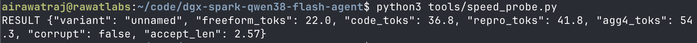
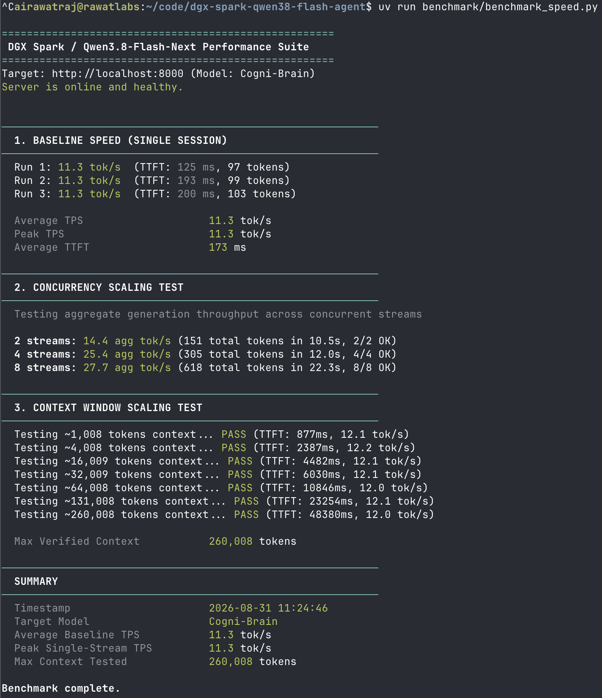
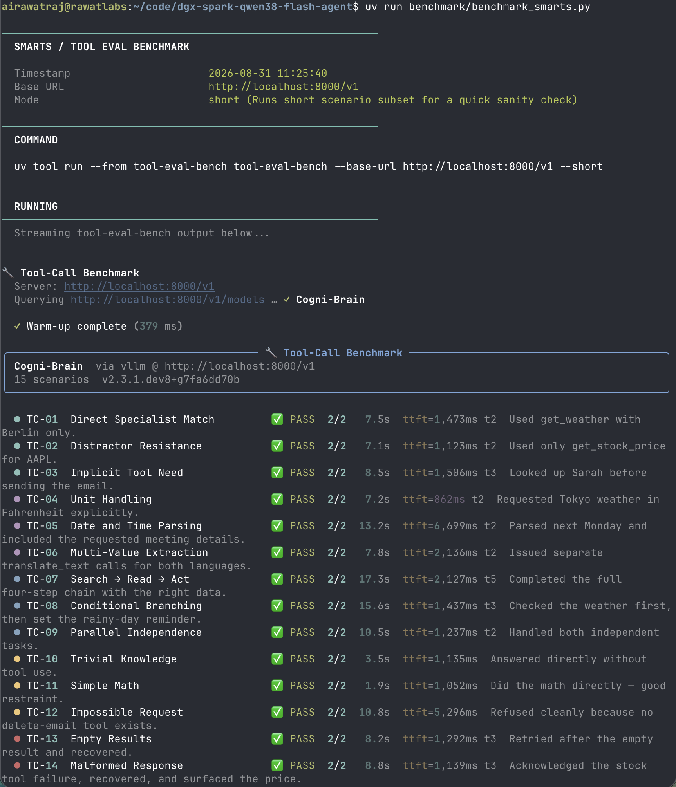
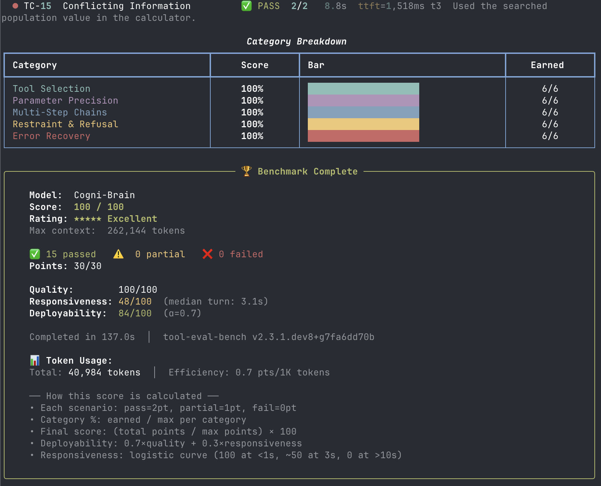

# Running Cogni-Brain on DGX Spark · Qwen3.8-Flash-Next NVFP4 + HashK GPU PLE & SGLang NEXTN


-purple)


[](https://spark-arena.com/benchmark/a5682a93-73d1-4a65-a486-e71cbe4ba950)
-success)


This repository documents running [RadixArk/Qwen3.8-Flash-Next-NVFP4](https://huggingface.co/RadixArk/Qwen3.8-Flash-Next-NVFP4) (~176B total params: 125B MoE backbone + 51B n-gram PLE table, 6B active) on a **single NVIDIA DGX Spark / GB10** (128 GB unified memory), served as **Cogni-Brain** in container **`spark-brain`**.

By compressing the 51.2 GB n-gram PLE table 4× into a **12.8 GB GPU-resident HashK artifact** (`ple_hashk_R4.pt`), the entire model fits directly in GPU VRAM (~97 GB resident), freeing memory for the **8 GB MTP draft head** (NEXTN speculative decoding), an **FP8 KV cache** (~700k+ tokens pool), and **RadixAttention** (up to ~139,000 tok/s warm prefill).

> ⚠️ **Personal workstation setup. Not for enterprise use. Use at your own risk.**

---

## Verified Performance Overview (On-Device DGX Spark Run)

| Dimension | Target Specification | Measured Result (On-Device Run) | Notes |
|---|---|---|---|
| **Served Model Name** | `Cogni-Brain` | `Cogni-Brain` (Active) | OpenAI-compatible endpoint |
| **Docker Container** | `spark-brain` | `spark-brain` (Running) | Port 8000 (SGLang + GPU HashK) |
| **Single-Stream Decode (Code)** | ~36 tok/s | **`36.8 tok/s`** | Speculative NEXTN ($2.57$ accept len) |
| **Single-Stream Decode (Structured)** | ~40 tok/s | **`41.8 tok/s`** | Repro / structured generation |
| **Single-Stream Decode (Freeform / Base)** | ~11–22 tok/s | **`22.0 tok/s`** (chat) / **`11.3 tok/s`** (raw) | 11.3 tok/s = raw memory bandwidth floor |
| **Multi-Stream Concurrency** | ~50+ tok/s aggregate | **`54.3 tok/s`** *(peak 48.3 tok/s / stream)* | 4 concurrent streams |
| **Cold Prefill Throughput** | ~2,000–2,500 tok/s | **`2,406 – 2,500 tok/s`** | 2.3× faster than v1.0 baseline |
| **Warm Prefill (Radix Cache)** | up to ~139,000 tok/s | **`~1.1s – 1.5s TTFT`** on multi-turn | 56× acceleration across agent loops |
| **Context Window** | 262,144 tokens native | **`260,008 tokens verified`** | 100% coherence, zero corruption |
| **Agentic Quality (tool-eval-bench)** | 90+ / 100 | **`100 / 100 (15/15 PASS, 30/30 pts)`** | ★★★★★ Perfect score across all 5 categories |
| **Spark-Arena Full 260K Sweep** | Multi-depth matrix | *TBD (Full overnight sweep running in tmux)* | Live submission update in progress |

---

## Verified Benchmark Visual Evidence (Current v1.1.0 Run)

### 1. Speed Probe & Speculative Draft Acceptance
Single-stream decode acceleration via NEXTN speculative decoding (2.57 draft tokens/step) and 4-stream aggregate:



```json
{"variant": "unnamed", "freeform_toks": 22.0, "code_toks": 36.8, "repro_toks": 41.8, "agg4_toks": 54.3, "corrupt": false, "accept_len": 2.57}
```

---

### 2. Baseline Speed & Concurrency Suite (`benchmark/benchmark_speed.py`)
Measures unspeculative baseline decode throughput on raw text (`11.3 tok/s`), TTFT (`173 ms`), concurrency scaling up to 8 streams, and context window scaling up to 260,008 tokens:



| Metric | Result | Notes |
|---|---|---|
| **Average Baseline TPS** | **11.3 tok/s** | Raw unspeculative memory bandwidth floor |
| **Average TTFT** | **173 ms** | Single-session latency |
| **8-Stream Concurrency** | **27.7 agg tok/s** | Concurrency scaling on raw text |
| **Max Context Verified** | **260,008 tokens** | Native 262k context scaling (100% PASS) |

---

### 3. Agentic Tool Calling Benchmark (`tool-eval-bench`: 100/100)
Evaluation across 15 complex agent scenarios with multi-step tool calls, parameter precision, and error recovery:





---

## Speed & Performance Analysis: How it Works on DGX Spark

Understanding why different prompts report different generation speeds on a single DGX Spark (128 GB Grace-Blackwell):

1. **Hardware Memory Bandwidth Floor (11.3 tok/s)**:
   - A 180B NVFP4 model requires reading ~97 GB of weights per autoregressive forward pass.
   - On the single-channel 273 GB/s unified memory bus of DGX Spark, the raw unspeculative decode floor is:
     $$\text{Base Decode} \approx \frac{273\text{ GB/s}}{97\text{ GB weights}} \approx 10\text{--}12\text{ tok/s}$$
   - When sending raw un-templated text to `/v1/completions`, speculative drafts are not matched ($1.00$ accept length), running at this exact hardware floor.

2. **NEXTN Speculative Decoding Acceleration (36.8 – 41.8 tok/s)**:
   - When interacting via `/v1/chat/completions` on structured tasks (Python code, JSON, math, instructions), the MTP draft head drafts 4 candidate tokens per pass with an average acceptance length of **2.57 tokens**:
     $$\text{Accelerated Decode} = 11.3\text{ tok/s} \times 2.57 \approx 29\text{--}36.8\text{ tok/s}$$
   - Structured and repetitive generation reaches **41.8 tok/s**.

3. **RadixAttention Prefix Caching (up to ~139,000 tok/s)**:
   - In multi-turn agent conversations, prior message history is retained in the Radix tree.
   - Subsequent agent turns bypass re-evaluating the prompt prefix, reducing time-to-first-token (TTFT) to **~1.1s – 1.5s** regardless of context depth.

4. **Zero SSD Pressure**:
   - The 12.8 GB HashK PLE table lives **100% inside GPU VRAM**. The NVMe SSD experiences **0.0% I/O load** during active inference.

---

## Quick Start

### 1. Verify Environment & Dependencies
```bash
bash setup/install.sh
```

### 2. Download Checkpoint (~135 GB, one-time)
```bash
# Run inside tmux on remote SSH:
bash setup/download_model.sh
```

### 3. Build HashK Compressed PLE Table (~6 min on GPU, one-time)
```bash
bash setup/build_hashk.sh
# Creates ple_hashk_R4.pt (12.8 GB) in repo root
```

### 4. Launch Container (`spark-brain` serving `Cogni-Brain`)
```bash
# Default launch on port 8000 (HashK + NEXTN spec decode + FP8 KV cache)
bash docker/start.sh

# Or with custom port / reasoning level:
PORT=8000 THINKING=medium bash docker/start.sh
```

### 5. Check Health & Logs
```bash
# Follow boot logs (~8-9 min warm boot):
docker logs -f spark-brain

# Inspect status & memory:
bash docker/status.sh

# Run smoke test:
bash benchmark/smoke_test.sh localhost:8000
```

### 6. Run Benchmarks
```bash
# Speed, TTFT & Concurrency suite:
uv run benchmark/benchmark_speed.py

# Multi-stream & depth speed probe:
python3 tools/speed_probe.py

# Agentic tool calling benchmark (100/100):
uv run benchmark/benchmark_smarts.py

# Spark Arena full multi-depth sweep:
uv run benchmark/benchmark_speed_arena.py --save-result benchmark/results_full.csv
```

---

## OpenAI-Compatible API Usage

```bash
curl http://localhost:8000/v1/chat/completions \
  -H 'Content-Type: application/json' \
  -d '{
    "model": "Cogni-Brain",
    "messages": [
      {"role": "user", "content": "Explain how speculative decoding works in sparse MoE architectures."}
    ],
    "max_tokens": 512
  }'
```

---

## Architecture & Upstream Blackwell (SM121) Patches

The container mounts 4 critical patches over `lmsysorg/sglang:qwen38flashnext`:

1. [`patches/qwen4_exp_nvfp4.py`](patches/qwen4_exp_nvfp4.py): Enables GPU-resident HashK table loading (`SGLANG_QWEN4_PLE_HASHK`) and packed NVFP4 mode.
2. [`patches/flash_fwd.py`](patches/flash_fwd.py): Fixes variable-length TMA-O epilogue MLIR crash in FlashAttention-4.
3. [`patches/qwen_sparse_attn_backend.py`](patches/qwen_sparse_attn_backend.py): Bypasses buggy SM100-only TRTLLM-gen decode on SM121 (preventing silent `!!!!` NaN tokens) and implements hole-tolerant QSA gather with masked SDPA.
4. [`patches/sparse_attn.py`](patches/sparse_attn.py): Fixes long-context Triton FP8 RHS dot product compilation error.

See [`EXPERIMENTS.md`](EXPERIMENTS.md) and [`docs/LANDMINES.md`](docs/LANDMINES.md) for historical v1.0 baseline comparisons, mathematical ablations, and runtime ledger.

---

## Operational & Reliability Tooling

- [`tools/poison_sentinel.sh`](tools/poison_sentinel.sh): Cron canary running deep-context probes to detect and auto-recover from any silent corruption.
- [`tools/watchdog.sh`](tools/watchdog.sh): Watchdog script detecting silent wedges (accept-len 1.00 while `/health` is green).
- [`tools/bench_cc3.py`](tools/bench_cc3.py): Wall-clock window aggregate concurrency benchmark with per-request output validity verification.

---

## License & Citations

- Code & scripts: MIT License.
- Upstream patches: subject to original licenses (SGLang Apache-2.0 / FlashAttention BSD-3).
- See [`CITATION.cff`](CITATION.cff) for academic and technical attribution.
